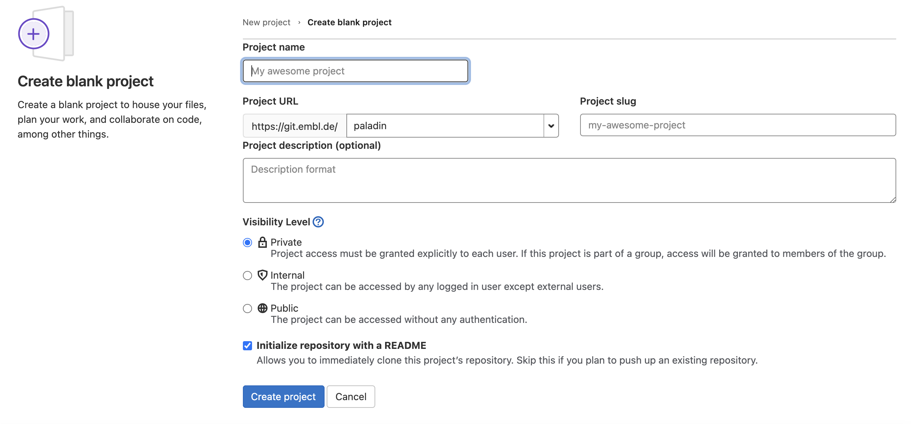
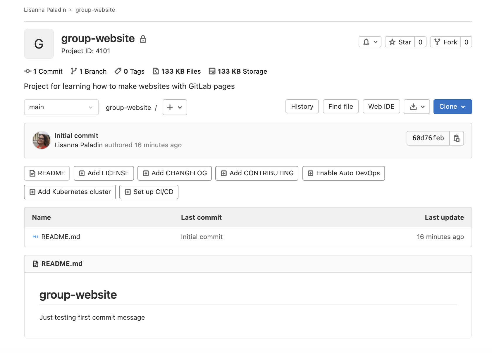

## How Websites Work

When we use a web browser to visit a page on the World-Wide Web,
the browser asks for information from a server -
a computer storing the data relevant to the site and configured to receive and respond to requests for that data.
Assuming there were no problems at this stage
(e.g. asking for a page which doesn't exist, or being unable to reach the server),
our browser receives and interprets this information
to render and display the webpage on our screen.

A web developer would probably be horrified to read such a gross oversimplification,
which is just one reason why
web developers are not the target audience of this tutorial.

The page displayed by the web browser is the result of combining
**HTML** - a hierarchical format describing the structural elements of the page and their raw content - with
**CSS** - an ordered set of styling instructions telling the browser how the content should be organised and formatted -
and any **images** that should be embedded in the page.
Other information received from the server,
but not displayed by the browser,
includes **metadata**, **cookies**, and other non-visible elements in the HTML -
information about the site that could be relevant for a computer
but probably isn't interesting to a human
(there are [exceptions][qwantz-easter-egg-ext] to this) -
and scripts that the browser may run to do something
in response to various triggers.

## Hello World in HTML

When learning a new programming language,
you may often find a reference to the popular `Hello world` example.
These examples typically capture the simplest code that
can produce and display the text "Hello, World!" on screen.

As HTML requires certain tags to be present and almost always in matching pairs (open `<tag>` and closing `</tag>`),
HTML documents tend to get verbose rather quickly.

The simplest, valid HTML `Hello world` is:

~~~
<!DOCTYPE html>
<html>
  <head>
    <title>Page title</title>
  </head>
  <body>
    
Hello, World!

  </body>
</html>
~~~
{: .language-html }

So as you can imagine, writing long HTML documents by hand is rather painful.
Notice that we didn't specify anything about how and where the text should be displayed.

To achieve this we would additionally need to include stylized tags or Cascading Style Sheets (CSS) instructions.
If you do not provide CSS instructions (either inside your HTML document or as a separate file),
a web browser will make a best guess regarding the layout of HTML elements on the page based on its defaults.

> ## The Many Tags in HTML
>
> In the `Hello world` example above 5 different tags are used (`html`, `head`, `title`, `body` and `p`) in their open `<>` and closed `</>` form.
> We see also the special `doctype` tag that indicates the format and version of the document, in this case, [HTML(5)][html5-wikipedia].
>
> Many other tags exist to define:
> - *structural elements*, such as `table`, `div`, `span`, `nav`, `section`;
> - *lists*, such as `ul` (for unordered lists) and `or` (for ordered lists);
> - *stylized elements*, such as `i`/`em` (for *italics/emphasis*), `b`/`strong` (for **bold**) and `u` (for <u>underlined text</u>);
> - *headings*, numbered from `h1` to `h6` for titles and progressively smaller sub-titles;
> - *media elements*, such as `img`, `video`, `audio` to embed rich media content; and
> - *links*, using the important `a` (anchor) tag to link to sections in the same page or other pages within the same or external websites.
>
> The [list of valid HTML tags][html5-tags] is rather extensive,
> covering a rich range of features powering today's [world wide web][www-wikipedia].
{: .callout }

> ## Exercise: Writing Basic HTML
>
> Given the stylized text:
>
> <h1><em>Hello</em>, World!</h1>
>
> write the HTML that will produce the same result.
> **Hint** the big font is achieved by use of a heading.
>
> > ## Solution
> >
> > ~~~
> > <h1><em>Hello</em>, World!</h1>
> > ~~~
> > {: .language-html }
> {: .solution }
{: .challenge }

Let's write a more complex HTML example using a table showing the "Hello, World!" text in different languages that renders like:
{: .image-with-shadow width="600px" }

The HTML to produce such a table looks like this (you can copy+paste the snippet into the HTML file you created in the previous example):
~~~
<table>
    <tr><th>Language</th><th>Text</th></tr>
    <tr><td>English</td><td>Hello, World!</td></tr>
    <tr><td>French</td><td>Bonjour, le monde!</td></tr>
    <tr><td>Portuguese</td><td>Olá, Mundo!</td></tr>
    <tr><td>Serbian</td><td>Zdravo, svete!</td></tr>
</table>
~~~
{: .language-html }

Each row is enclosed between **t**able **r**ow `<tr>` and `</tr>` tags. Within a row, `<th>` and `</th>` tags are used to contain **t**able **h**eadings
(special table cells displayed in bold font), while regular **t**able **d**ata cells are contained within `<td>` and `</td>` tags.

A similar example written using HTML lists would look as follows:
{: .image-with-shadow width="600px" }

~~~
<ul>
    <li>English: Hello, World!</li>
    <li>French: Bonjour, le monde!</li>
    <li>Portuguese: Olá, Mundo!</li>
    <li>Serbian: Zdravo, svete!</li>
</ul>
~~~
{: .language-html }

Here, we used **u**nordered **l**ist tags `<ul>` and `</ul>` to define a list with 4 items, each in turn wrapped in
individual **l**ist **i**tem (`<li>` and `</li>`) tags.

## Static vs Dynamic Sites

_Static_ pages are those whose contents are stored on a server in a state ready
to be sent to any user who makes a request for that web page. When a request is
made, the server only needs to send the information comprising that web page
(such as HTML and CSS). Sites that do not change often, such as a website
containing one’s CV, are often stored as static sites.

Conversely, _dynamic_
sites are those that have their pages generated when a user makes a request for
a web page. Depending on when the request is made, the content might change; for
example, clicking refresh when viewing a discussion in a web forum might result
in new comments showing up. The key difference is that static pages need only be
generated once, after which they rest unchanged on the server, compared to
dynamic pages which are regenerated by a server every time it receives a
request.

> ## Examples in the Life Sciences field
>
> A typical example of _static_ website in the Life Science field would be the documentation
> of a tool or a file format, such as this page at [wwpdb.org](https://www.wwpdb.org/documentation/file-format).
>
> Entry pages of the [PDB database](https://www.rcsb.org/), instead, differently load content on the
> basis of the visualisation tools and options chosen by the user. A database or a webserver is usually
> a _dynamic_ website.
>
{: .callout}

This lesson focuses on static sites and tools that can be used to
create them, known as **Static Site Generators**.

One of the advantages of using static site generators is that
they remove the need for us to manually produce a lot of HTML,
allowing us to focus on the human-readable content we want our pages to contain.
However, we still need a way to tell the generator how we want our content
to look when it's displayed in the browser.
For that, we will use a tool called Markdown, which we'll learn about in a following episode.

_Figure 1.1: Page Generation Alternatives. This figure is a modified version of the original published in [JavaScript for Data Science][js4ds], and is reproduced here with permission from the author._

Static-generated sites are a great choice when the information you want to
display on a website is the same regardless of who visits your site
and when,
and if the content of your pages is unlikely to need to change very often.
This makes Static Site Generators a good choice for sites that provide
documentation or lesson content like this page:
the aim of the page is to deliver the same information to every visitor.
The visitor can arrive,
(hopefully) find and read what they need,
and leave feeling happy and fulfilled.

Dynamic sites provide a lot more possibilities for providing interactivity and
personalised or topical content.
But creating them is a degree more complicated
and also places considerable additional burden on the server,
not least in terms of computational requirements and security considerations.
Among other things this means that,
unlike with static pages (see the rest of this lesson),
you're unlikely to find cost-free platforms to help you deliver dynamic content.

> ## Exercise: The Perfect Tool for the Job
>
> Given the following types of websites,
> reason if a static site generator is an appropriate solution to implement them.
>
> - (1) A personal website with *About* and *Projects* sections
> - (2) A forum or discussion platform
> - (3) A community blog or news website
> - (4) A search engine (such as google.com)
> - (5) A wiki (such as wikipedia.com)
> - (6) An online book
>
> > ## Solution
> >
> > - (1) **personal website**: In most cases, **Yes**. This kind of content is typically written/edited by one person and meant to have a read-only access to visitors.
> > - (2) **forum or discussion**: Most likely **No**. Such website requires interactivity and ways to identify who wrote what content.
> >
> > For questions 3 and 5 the answer is both **Yes** and **No** depending on the requirements and necessary functionality.
> >
> > - (3) **blog/news**: A simple blog or news website, maintained by a small set of users, is perfectly achievable by using a static generator. For very large groups of content creators or if access to articles needs to be controlled individually, using a static generator will lead to difficult technical challenges.
> > - (4) **search engine**: Most often **No**. Implementing something as sophisticated as Google's search would be close to impossible with a static generator. There are ways to have a simple engine that searches across all pages produced by a static generator using indexing and making clever use of browser features but this approach has many limitations.
> > - (5) **wiki**: A simple wiki is perfectly doable with a static generator (e.g. [GitHub Wiki Pages](https://guides.github.com/features/wikis/)), however it becomes limiting as soon as its content needs to be edited or discussed by many users, as is the case of Wikipedia.
> > - (6) **online book**: Definitely **Yes**. Static generators are perfect for this type of website. They typically provide ways to avoid repeating content (variables and templates), automatic creation of a *Table Of Contents*, among other goodies.
>
> {: .solution }
{: .challenge }

## GitLab Pages

If the site you want to create is a good match to the strengths of a static site generator -
it's relatively __small__, will be __updated infrequently__, and the __content does not need to be personalised to the visitor__ -
then creating it with GitLab Pages is a good option.
GitLab Pages is a system allowing users to create and serve websites directly from their GitLab repositories.
The service is free for public repositories and simple pages can be created and served with very little configuration required.

We will go through a list of templates, of increasing complexity. While the first will be based on plain Markdown,
the more advanced ones will be based on multiple technologies (an example is shown in the diagram below).
It may sound overwhelming at first but we will explain most of these technologies in this lesson -
we only don't cover CSS/Sass (styling language that gets compiled into CSS) and
JavaScript/CoffeeScript (scripting language that gets compiled into JavaScript) in detail.

{: width="700px" }

First, we are going to set up a project to store our files and learn more about how to author and format the content
of our pages using HTML and Markdown, before configuring GitLab to display this content as a website using GitLab Pages.

## Setting Up a Project

Before we get into working we must first create a project to work in.
This project is similar to a folder on your computer, the main differences
being that the folder lives on the web in GitLab/GitHub (though you can
also keep a copy on your computer if needed) and that folder is using
a version control software called [`git`][git] to track changes to the files.
For our purposes we will mostly be ignoring the version control software,
though it can be handy if you need to revert to old versions
(see [Software Carpentry - Version Control with Git][swc-git] for an introduction).
In this lesson we will be working with this folder on the web to control
the website we will be creating.

> ## Login into your GitLab account
> Before you can create a repo, you will need to login in the
> [EMBL GitLab](https://git.embl.de/)
{: .callout}

There are two ways of creating a new project:

Click the "+" button in the navbar on top and choose "new project"

{: .image-with-shadow width="100px" }

**or**, if you are on the projects page, click the "New project" button

{: .image-with-shadow width="200px" }

You will be redirected to a page that provides three options:
1. Create blank project
1. Create from template
1. Import project
Take your time to read the descriptions of the different cases. Please select "Create blank project".

Next you will need to fill in some info about your project.

{: .image-with-shadow width="600px" }

In this lesson, we will be working on a general group website.
You can imagine this website may be for your lab group, a specific project group, or another group you work with.
Under the "Project name" field, type `group-website`.

The `Project slug` will determine the URL to access your project and website, it is automatically generated when you fill
the `Project name` field. Leave it as is.

Have a look at the dropdown menu next in the `Project URL` field. The default option is your own user, this refers to
your own namespace. Other namespaces might be available, depending on which groups you belong to. For example, if this is
planned to be your group website, it may be a good choice to select your group namespace to host it. This both to provide
easy access to the project to other group members and to have your group name (and not your user name) in the website URL.
However, we will initialise this test projects in our own namespace.

We can also add a description (for instance "Project for learning how to make websites with GitLab pages") so we know
what this project is when we find it again after the workshop.

We will also check the `Initialize repository with a README` option. It is good practice to have a README file that
gives more information about your repo.

> ## GitLab vs GitHub
>
> Most of the steps here described are very similar in GitHub. What GitLab calls "Project", in GitHub is a "Repository",
> so if your instructor confuses the two terms here is why. In addition, the "Groups" are in GitLab "organisations".
>
> More relevant are the differences regarding the visibility level and setup options. In GitHub, only two options are
> available for a repository: "Public" or "Private". The EMBL GitLab allows a more specific fine tuning of the permissions
> through the option "Internal", i.e. accessible only by logged in user. Finally, while GitLab only allows to initialize
> the repository with a README, GitHub includes the option to initialise it with a .gitignore and license files too.
{: .callout}

Once you've finished these steps you can click the `Create Project` button. GitLab will then setup the repo and it
should create the repo called `group-website` with a `README.md` file in it. What the graphical interface just helped us
doing, is basically the following steps:

~~~
mkdir group-website
cd group-website
git init
cat > README.md
git add README.md
git commit -m "Initial commit"
~~~
{: .language-bash }

On a remote server. The default branch is `main`.

{: .image-with-shadow width="800px" }

Before moving on to the next chapter, have a look at the buttons on top, such as `Add LICENSE`, `Add CHANGELOG` etc.,
suggesting you possible next steps. To name one, the License is definitely something you might want to include in your
project. We will not be looking into this in detail, but please consider that licensing is a good practice (if not a
necessary one) for any project that includes data or software. Your website, even if a very simple and static one, will
include some sort of *data*, even just people names. The technologies and templates you will use to generate it are
*software*. A word to the wise.

[qwantz-easter-egg-ext]: https://chrome.google.com/webstore/detail/dinosaur-comics-easter-eg/bojkkeeefjmeogpgnlomodfkkfkfhabj
[js4ds]: http://js4ds.org


