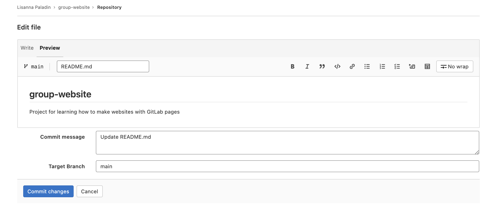

# Markdown
Markdown is a lightweight markup language, i.e. a convention for adding
style information to textual content.
As the name Markdown indicates, the syntax elements of this language
are shut *down* to a minimum.
Having a rather minimalistic syntax, text formatted in Markdown is comparably
readable.
This might be one reason for Markdown having become the language of choice
for formatted user input on websites like, for example:
- [Stack Exchange](https://stackexchange.com/)
- [GitLab](https://about.gitlab.com/)
- [GitHub](https://github.com/).

# Where to Start Writing Markdown?
A lot of tools for rendering Markdown source code exist.
Rendering is the process of generating a nice view of the content
using the style information included in the source text.
Chances are high, your editor can do this.
As we are working towards authoring websites using GitLab pages,
we will use GitLab straight away for learning the basics of Markdown.
The GitLab project you created in the last episode contains a file `README.md`.
Click on the file name to access it.

The image below shows the default view.
This view includes a rendered view of the content inside the file `README.md`, like the one in our project homepage.

{: .image-with-shadow width="900px" }

The buttons on the right allow you to interact with the file and visualisation. The first couple of buttons,
the ones with the icons, allow you to switch between `Display source` and `Display rendered file`. Over with the mouse
on them to display these two messages in tooltips. The source is the non rendered view of our file. We can edit it
through the blue `Edit` button. Click it.

{: .image-with-shadow width="900px" }

We can change the content and have a look at the rendered view by clicking the `Preview` tab on top.

{: .image-with-shadow width="900px" }

Let's add `Some **bold** font` and see what happens when we preview it using the preview tab. What happened to the world bold?

To save the content to the file `README.md`, we should click the `Commit changes` button at the bottom of the page.
Please notice: this is not a simple "Save" button, but an actual commit. This version of the project will be stored in
git with the `Commit message` that you will specify in the commit menu here and in the branch you settle as `Target branch`.
We only have the main branch for the moment - so that choice is obvious - and the commit message is precompiled with the
name of the file you just edited. You may want to be more specific in your commit message, but for the moment let's go
with the default option provided. Commit this change.

> ## Writing a Commit Message
>
> A commit message is a short, descriptive, and specific comment that will help us remember later on what we did and why.
> You find more about writing commit message in [this section](https://swcarpentry.github.io/git-novice/04-changes/index.html) of the Git-novice lesson.
>
{: .callout}

{: .image-with-shadow width="900px" }

The interface redirects you to the main project page. On the top, a message says "Your changes have been successfully
committed." Our changes were included in the README file, that now shows the second line with the bold font.

# Writing Markdown

Now that we know about the editing interface and preview tab of our projects `README.md`
we can use it as a text editor and investigate selected Markdown features.

Our `README.md` already contains text and two formatting features:
- Heading `# group-website`
- Emphasis using `**bold**`.

Let's learn some more Markdown by adding some formatting and see what happens when we preview it using the preview tab.
Add the following to your `README.md` file.

~~~
# group-website
Repo for learning how to make websites with GitLab pages

## Learning Markdown

Vanilla text may contain *italics* and **bold words**.

This paragraph is separated from the previous one by a blank line.
Line breaks
are caused by two trailing spaces at the end of a line.

[Carpentries Webpage](https://carpentries.org/)

### Carpentries Lesson Programs:
- Software Carpentry
- Data Carpentry
- Library Carpentry
~~~
{: .language-markdown }

You can then click the preview tab again to see how the formatting renders.

{: .image-with-shadow width="900px" }

> ## Markdown Trailing Spaces Are Meaningful
>
> In the example above there are two spaces at the end of `Line breaks  `.
> These introduce what is called a **hard line break**, causing that paragraph to
> continue in the next line by adding a ` ` to the generated HTML.
>
> If you break the line in a markdown file but don't include the two trailing spaces
> the generated HTML will continue in the same line **without** introducing a ` `.
> This is called a **soft line break**.
>
> In some cases you may find that **soft line breaks** do introduce a ` `.
> This can happen when using different [markdown flavors](#markdown-flavours).
> {: .language-markdown }
>
{: .callout}

You can commit these changes to save them. But first, let's do an exercise to try out writing more markdown.

> ## Exercise: Try Out Markdown
> Use [this cheatsheet][gitlab-flavored-markdown] to add the following to your `README.md`:
>
> - Another second level heading
> - Some text under that second level heading that includes an link and ~~strikethrough~~ text.
> - A third level heading
> - A numbered list
> - Bonus: Add this image <https://github.com/carpentries/carpentries.org/blob/main/images/TheCarpentries-opengraph.png>
>
> > ## Example Solution
> > For example your markdown might look like the following:
> > ~~~
> > ## More info on the lesson
> > You can find this lesson [here](https://grp-bio-it-workshops.embl-community.io/building-websites-with-gitlab/).
> >
> > ### Four reasons you should learn Markdown:
> >
> > 1. Less formatting than HTML
> > 2. Easy to read even with formatting
> > 3. Commonly used for websites and software development
> > 4. We ~~don't~~ use it in The Carpentries
> >
> > 
> > ~~~
> > {: .language-markdown }
> >
> {: .solution }
{: .challenge }

> ## Reference-Style Links
>
> Up to now, we have used _inline-style_ links which have the URL inline with the description text, for example:
>
> ~~~
> [Carpentries Webpage](https://carpentries.org/)
> ~~~
> {: .language-markdown }
>
> If you use a link more than once, consider using so called _reference-style_ links instead.
> Reference-style links reference the URL via a label.
> The label goes into square brackets `[ ]` right after the description text of the link and
> then later, usually at the bottom of the page, you can connect that label to the url it references to complete the link.
> This looks like:
> ~~~
> [Carpentries Webpage][carpentries]
>
> [carpentries]: https://carpentries.org/
> ~~~
> {: .language-markdown }
>
{: .callout}

We will continue to use Markdown and learn more throughout the rest of the lesson. Whether you decide to structure your
website through Markdown-based technologies or HTML, you will still need to know some basics of Markdown to edit your
README file. The README file will provide an essential guide - shown in the landing page of your project - for your
collaborators and also for you to understand what the project is about and how to contribute.

> ## Markdown Flavours
>The initial description of Markdown was informal and contained certain ambiguities so over the years [different Markdown
>implementations and syntax variations](https://github.com/commonmark/commonmark-spec/wiki/markdown-flavors) (often referred to as "flavours")
>appeared to support various syntax features and extensions. As a consequence, the syntax from one variant may not
>be interpreted as expected in another - you have to be aware which one is being used by a particular platform. Here are
>a few well-known variants:
>   - [GitLab-flavored Markdown][gitlab-flavored-markdown] (used on this lesson and by GitLab)
>   - [GitHub-flavored Markdown][github-flavored-markdown] (used by GitHub)
>   - [Kramdown][kramdown] (a fast, Ruby, open source implementation released under the MIT licence)
>
> Mardown is also the language of the collaborative notes platform available at EMBL. You can acces it
> [here](https://pad.bio-it.embl.de/). The platform is based on [CodiMD](https://github.com/hackmdio/codimd).
{: .callout}

> ## Exercise: Add Your Repository Details to CodiMD
>
> Use Markdown syntax to add a link in the collaborative notes document you are using to follow along with this lesson.
> The link text should be your GitLab username, and the target your repository.
{: .challenge }

[kramdown]: https://kramdown.gettalong.org/
[gitlab-flavored-markdown]: https://docs.gitlab.com/ee/user/markdown.html
[github-flavored-markdown]: https://github.com/adam-p/markdown-here/wiki/Markdown-Cheatsheet


