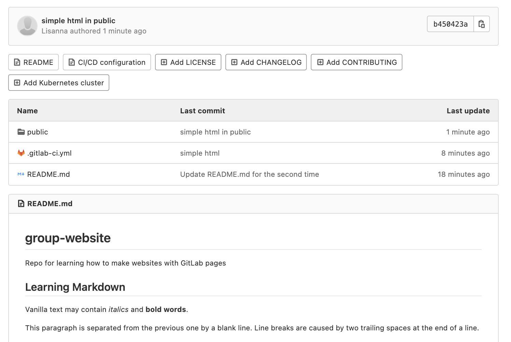
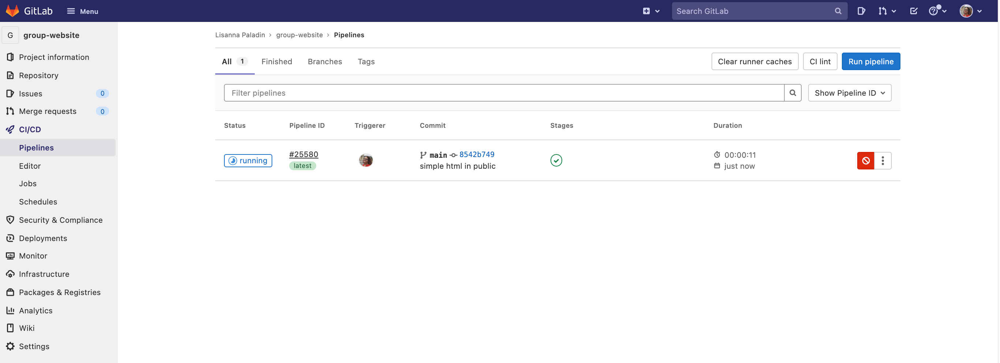
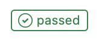
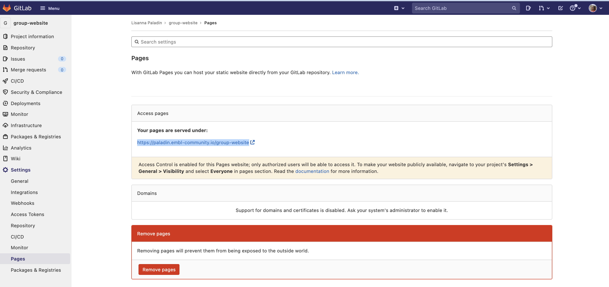
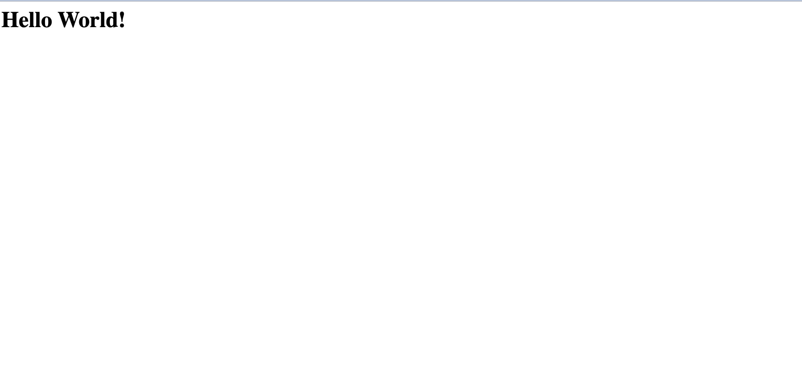
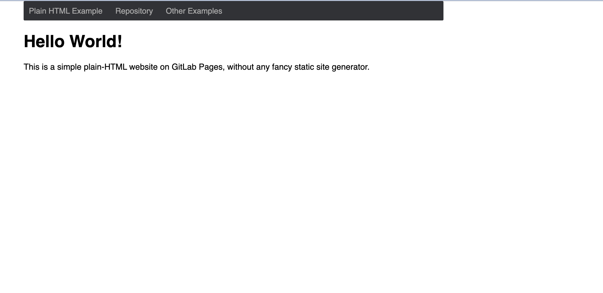

# GitLab pages

> ## Static websites only
>
> As anticipated by the previous chapters, to publish a website with GitLab Pages you can use several different technologies
> like Jekyll, Gatsby, Hugo, Middleman, Harp, Hexo, and Brunch, just to name a few. You can also publish any _static_ website
> written directly in plain HTML, CSS, and JavaScript. Pages does not support _dynamic_ server-side processing, for
> instance, as `.php` and `.asp` requires.
{: .callout}

The key to having your website up and running as expected is the GitLab CI configuration file, called `.gitlab-ci.yml`.
This file configures how your website will be built. It is written in _YAML_, which has its own syntax that we will not
explain into details, so we recommend you follow this quick start guide before setting it up.
To work correclty, it needs to be placed at your root directory, i.e. at the same level of our README file, in the main project folder.

The most important fact is that with GitLab CI, you take control over your builds. They won't be in an invisible black
box where you don't know what is going on! You will be able to see any build running live by navigating to your
project's `Pipelines` (we will do this later). You can also add any command to your `.gitlab-ci.yml` script. This allows
you to do in the remote server pretty much anything you do on your local machine. We will how some examples on how to run
custom build commands through the `.gitlab-ci.yml.` file later on in this lesson.

It is time to start configuring our project for deployment. In this lesson, we will work on our local instance of the
project (in your own computer), to be able to add to each commit changes in multiple files simultaneously. To do so,
you will need to _clone_ your repository locally, check the [git novice](https://swcarpentry.github.io/git-novice/)
lesson if you need to review what the `git clone` command does and how to `git push` changes from local to remote projects.

In short, you should now run, from a terminal:
~~~
git clone https://git.embl.de/<your username>/group-website.git
cd group-website
~~~
{: .language-bash }

And keep working in your cloned directory. You can add and edit your files via `vim` or from any editor that you like -
it doesn't have to be launched from the terminal, but remember to keep the terminal open for when you will have to push
the changes back to the remote.

We will start with the simplest example, a plain HTML site with GitLab pages. Create your `.gitlab-ci.yml` file and write in it:

~~~
pages:
  stage: deploy
  script:
    - echo 'Nothing to do...'
  artifacts:
    paths:
      - public
  only:
    - main
~~~
{: .language-yaml }

What this code is doing is creating a job called "pages" telling GitLab to __deploy the website__ content in `public`,
__whenever a commit is pushed__ and __only to the main branch__. It doesn't have much to do but looking at the content
in public, hence the "script" configuration is basically none (it just echoes "Nothing to do" to the terminal).

> ## Validating the gitlab-ci.yml file
>
> Before you push any `.gitlab-ci.yml` to your project, you can validate its syntax with the tool called
> [CI Lint](https://docs.gitlab.com/ee/ci/lint.html). You need to be logged into your account to have access to this tool.
> It's found by navigating to your project's Pipelines: there is a button at the top-right of your screen. You can
> read through the [full documentation](http://doc.gitlab.com/ee/ci/yaml/README.html) for .gitlab-ci.yml for more information.
>
{: .callout}

> ## Git branches and GitLab CI files
>
> You can have a distinct `.gitlab-ci.yml` for each project - but you could even have distinct GitLab CI configurations
> for each branch. This means you could test your script in parallel branches before pushing to your main branch.
> If the build succeeds, you merge. If it doesn't, you can make adjustments and try building again without messing up
> your main branch.
>
{: .callout}

Next, we will create the `public` folder, containing an `index.html` file. You can do so from the terminal through:

~~~
mkdir public
cat > public/index.html
~~~
{: .language-bash }

Populate the new file write this content:

~~~
<html>
    <head>
        <title>Home</title>
    </head>
    <body>
        <h1>Hello World!</h1>
    </body>
</html>
~~~
{: .language-html }

Before we go on with the chapter, try to imagine what will displayed in the resulting webpage. You can draw it in a piece
of paper.

Now, commit and push your changes. You can do so from the main folder through:

~~~
git add .
git commit -m "simple html in public"
git push -u origin main
~~~
{: .language-bash }

Go back to your remote project in GitLab (in the web browser). The screenshot below shows how it should look like:

{: .image-with-shadow width="600px" }

The `public` folder contains the `index.html` file. The push command you just launched should have triggered your first
pipeline. On the menu on the left, choose `CI/CD > Pipelines` to visualise it.

{: .image-with-shadow width="600px" }

Since we stopped and checked what our remote folder looked like, your pipeline may already be
{: .image-with-shadow width="100px" }. If not, just wait until it becomes so.

Your first website was deployed successfully! Wonder where you can see it? Go to `Settings > Pages`. The URL of your
website is reported under `Access pages`. It should be: `https://<your user name>.embl-community.io/group-website`.

{: .image-with-shadow width="600px" }

The screenshot below also contains an interesting alert. Always read this type of messages prompted by the GitLab
interface, this are usually relevant to you. It says "Access Control is enabled for this Pages website;
only authorized users will be able to access it. To make your website publicly available, navigate to your
project's Settings > General > Visibility and select Everyone in pages section." It also links to further documentation
if you want to know more. Follow the instructions if you would like to make your website public.

Wheter it's public or not, we should be able to visualise our own website. Click on the link, and here it is:

{: .image-with-shadow width="600px" }

> ## Exercise: Compare with your sketch
> Does the website you just deployed look as you thought it would, given the html code in the index file?
> Did you think that something else would be shown? Discuss with the colleague next to you.
>
{: .challenge }

> ## Exercise: The plain-html template
> GitLab provides a series of templates of web pages deployed through Pages. One of them is called "plain-html", you
> can access it at [this link](https://gitlab.com/pages/plain-html). The general structure is quite similar to the one
> we just used. Go to the `public` folder. There are two files here, one `style.css` file and one `index.html` file.
>
> We will now go into the detail of `.css` file functioning in this lesson, but it might be interesting now to have a look
> at its syntax and content. This type of file is used to style HTML content. This specific file provides styling
> instructions for three elements: the `body`, the `navbar` and the link text (`a`) within the navbar, that changes
> color when the mouse is over it (`a:hover`). Don't worry now about understanding how this works exactly, but when you
> will visualise this page, remember to go with the mouse over the navbar links to see this in action.
>
> Now open the `index.html` file. Its content is reported below.
>
> ~~~
> <!DOCTYPE html>
> <html>
>  <head>
>    <meta charset="utf-8">
>    <meta name="generator" content="GitLab Pages">
>    <title>Plain HTML site using GitLab Pages</title>
>    <link rel="stylesheet" href="style.css">
>  </head>
>  <body>
>    

>      <a href="https://pages.gitlab.io/plain-html/">Plain HTML Example</a>
>      <a href="https://gitlab.com/pages/plain-html/">Repository</a>
>      <a href="https://gitlab.com/pages/">Other Examples</a>
>    

>
>    <h1>Hello World!</h1>
>
>    

>      This is a simple plain-HTML website on GitLab Pages, without any fancy static site generator.
>    

>  </body>
> </html>
> ~~~
> {: .language-html }
>
> Time to sketch again! Draw the resulting webpage, provided this HTML file content. Hint: the navbar is a bar on
> the top of the page, that allows us to navigate the website content.
>
> Optional question: how is the `.css` file used? How does the website know which is the right file to read?
>
> > ## Solution
> >
> > You can go to the [deployed website](https://pages.gitlab.io/plain-html/) to check how does it look like.
> > Here below a screenshot of the result:
> >
> > {: .image-with-shadow width="600px" }
> >
> > Is there any difference with your sketch?
> >
> > Optional question: the `.css` file location is specified in the `.html` file, through:
> > `<link rel="stylesheet" href="style.css">`.
> >
> {: .solution }
{: .challenge }

## Useful links

You have the minimal tools now to be able to play around with HTML and css. You can copy the two files
from the last exercise [template](https://gitlab.com/pages/plain-html) into your repository and try to edit
the text size, the navbar color, add links or text formatting. If you decide to fork this repository to experiment,
please do as the authors ask in their README file (one more reason to consult the README files in each other projects
and to compile them carefully): "If you forked this project for your own use, please go to your project's
__Settings__ and remove the forking relationship, which won't be necessary unless you want to contribute back to
the upstream project."

An extensive tutorial about HTML elements, including examples of forms, media and links embedding, can be found at
[w3schools](https://www.w3schools.com/html/default.asp). In addition to this one, many other resources provide
HTML tutorials, you can definitely choose one that fits your tastes to learn more.


