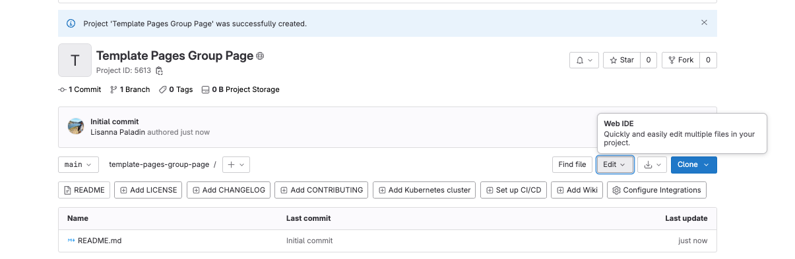
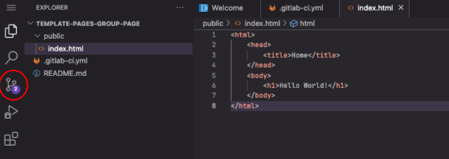
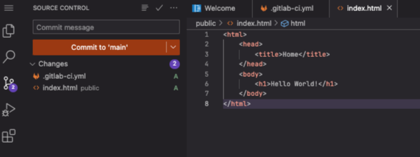
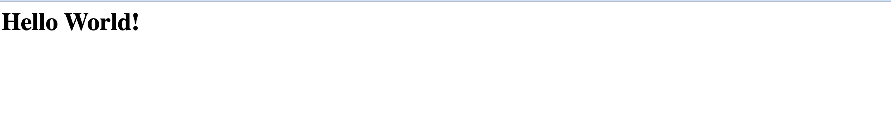

::::::::::::::::::::::::::::::::::::::: objectives

- publicar HTML en la red con GitLab Pages

::::::::::::::::::::::::::::::::::::::::::::::::::

:::::::::::::::::::::::::::::::::::::::: questions

- ¿Cómo publicio mis páginas via GitLab?

::::::::::::::::::::::::::::::::::::::::::::::::::

## PGitLab pages

:::::::::::::::::::::::::::::::::::::::::  callout

## Sólo sitios web estáticos

Como se anticipó en los capítulos anteriores, para publicar un sitio web con GitLab
Pages puedes utilizar varias tecnologías diferentes como Jekyll, Gatsby, Hugo,
Middleman, Harp, Hexo, y Brunch, sólo por nombrar algunas. También puedes publicar
cualquier sitio web *estático* escrito directamente en HTML plano, CSS y JavaScript.
Pages no soporta el procesamiento *dinámico* del lado del servidor, por ejemplo, como
requieren `.php` y `.asp`.

::::::::::::::::::::::::::::::::::::::::::::::::::

La clave para que tu sitio web funcione como se espera es el archivo de configuración de
GitLab CI, llamado `.gitlab-ci.yml`. Este archivo configura cómo se construirá tu sitio
web. Está escrito en *YAML*, que tiene su propia sintaxis que no explicaremos en
detalle, por lo que te recomendamos que sigas esta guía de inicio rápido antes de
configurarlo. Para que funcione correctamente, debe colocarse en su directorio raíz, es
decir, al mismo nivel que nuestro archivo README, en la carpeta principal del proyecto.

El hecho más importante es que con GitLab CI, tomas el control sobre tus compilaciones.
No estarán en una caja negra invisible donde no sabes lo que está pasando Serás capaz de
ver cualquier compilación ejecutándose en vivo navegando a la `Pipelines` de tu proyecto
(lo haremos más adelante). También puedes añadir cualquier comando a tu script
`.gitlab-ci.yml`. Esto le permite hacer en el servidor remoto prácticamente cualquier
cosa que haga en su máquina local. Más adelante veremos algunos ejemplos de cómo
ejecutar comandos de construcción personalizados a través del archivo `.gitlab-ci.yml.`.

::::::::::::::::::::::::::::::::::::::::  callout

## Trabaja localmente o en GitLab

Esta lección no pretende enseñar Git y cómo trabajar localmente (en tu portátil) en un
proyecto versionado y gestionado en Git. Sin embargo, si tienes una comprensión básica
de Git, puedes hacer los siguientes pasos localmente para aprender a desarrollar
correctamente un sitio web: probarlo localmente y sólo confirmar y empujar versiones
significativas del mismo. Por el contrario, trabajar en la plataforma en línea nos
obligará a cometer versiones que no serán muy significativas, en aras del aprendizaje.

Si usted tiene una comprensión básica de Git, la configuración de un proyecto local
para el despliegue. *Clone* su repositorio localmente (consulte la lección [git novice](https://swcarpentry.github.io/git-novice/) si necesita repasar lo que hace el
comando `git clone` y cómo `git push` cambios de proyectos locales a remotos). En
resumen, ahora deberías ejecutar, desde un terminal:

```bash 
git clone https://git.embl.de/<your username>/group-website.git
cd group-website
```

Y sigue trabajando en tu directorio clonado. Puedes añadir y editar tus archivos a
través de `vim` o desde cualquier editor que te guste - no tiene que ser lanzado desde
el terminal, pero recuerda mantener el terminal abierto para cuando tengas que empujar
los cambios de nuevo al remoto.

::::::::::::::::::::::::::::::::::::::::::::::::::

Empezaremos con el ejemplo más simple, un sitio HTML plano con páginas GitLab.

Vamos a crear el archivo `.gitlab-ci.yml` directamente en nuestro proyecto GitLab
online. Tendremos que trabajar en varios archivos. Para ello, queremos abrir el IDE Web
haciendo clic en el botón en la parte superior derecha de nuestro proyecto: `Edit > Web IDE`.

{alt='Edit IDE' .image-with-shadow width="600px" }

Si es la primera vez que lo abre, aparecerá un panel de personalización. Ignórelo por
ahora, pero sepa que el *look-and-feel* de las siguientes capturas de pantalla puede
diferir de lo que ve basado en la plantilla por defecto. Sin embargo, deberías tener los
mismos menús y archivos disponibles para su uso. En particular, el `EXPLORER` (un
explorador de archivos) a la derecha lista los archivos y carpetas de su repositorio
(por el momento, sólo debería haber el archivo `README`), y el panel de la derecha
muestra el contenido de dichos archivos cuando los abre.

Pasa el ratón por encima del nombre de tu proyecto en la carpeta `EXPLORER` para ver un
pequeño menú que incluye un icono para añadir archivos a la carpeta. Haga clic en él y
cree un archivo `.gitlab-ci.yml`. A continuación, rellénalo con el siguiente contenido

Crea tu fichero `.gitlab-ci.yml` y escribe en él:

```yaml 
pages:
  stage: deploy
  script:
    - echo 'Nothing to do...'
  artifacts:
    paths:
      - public
  only:
    - main
```

> 
Lo que hace este código es crear un trabajo llamado "pages" que le dice a GitLab que
**despliegue el contenido del sitio web** en `public`, **siempre que se envíe un
commit** y **sólo a la rama principal**. No tiene mucho que hacer más que mirar el
contenido en público, de ahí que la configuración del "script" sea básicamente ninguna
(sólo hace eco de "Nada que hacer" en el terminal).

:::::::::::::::::::::::::::::::::::::::::  callout

## Validando el archivo gitlab-ci.yml

Antes de añadir cualquier `.gitlab-ci.yml` a su proyecto, puede validar su sintaxis
con la herramienta llamada [CI Lint](https://docs.gitlab.com/ee/ci/lint.html).
Necesitas estar conectado a tu cuenta para tener acceso a esta herramienta. Se
encuentra navegando a los Pipelines de tu proyecto: hay un botón en la parte superior
derecha de tu pantalla. Puedes leer la [documentación completa](https://doc.gitlab.com/ee/ci/yaml/README.html) de .gitlab-ci.yml para más
información.

::::::::::::::::::::::::::::::::::::::::::::::::::

:::::::::::::::::::::::::::::::::::::::::  callout

## Ramas Git y archivos GitLab CI

Puedes tener un `.gitlab-ci.yml` distinto para cada proyecto - pero incluso podrías
tener distintas configuraciones de GitLab CI para cada rama. Esto significa que
podrías probar tu script en ramas paralelas antes de enviarlo a tu rama principal. Si
la compilación tiene éxito, se fusiona. Si no, puedes hacer ajustes y tratar de
construir de nuevo sin estropear tu rama principal.

::::::::::::::::::::::::::::::::::::::::::::::::::

A continuación, crearemos la carpeta `public` (usa el icono de nueva carpeta en el menú
`EXPLORER`), que contiene un archivo `index.html`.

::::::::::::::::::::::::::::::::::::::::  callout

## Trabaja localmente o en GitLab

Si estás trabajando en local, puedes hacerlo desde el terminal a través de:

```bash 
mkdir public
cat > public/index.html
```

::::::::::::::::::::::::::::::::::::::::::::::::::

Rellena el nuevo fichero `index.html` con este contenido:

```html 
<html>
    <head>
        <title>Home</title>
    </head>
    <body>
        <h1>Hello World!</h1>
    </body>
</html>
```

> 
Antes de seguir con el capítulo, intenta imaginar cuál será la visualización final en la
página web resultante. Puedes dibujarlo en un papel.

::::::::::::::::::::::::::::::::::::::::  callout

## Trabaja localmente o en GitLab

Si estás trabajando localmente, ahora confirma y envía tus cambios. Puedes hacerlo
desde la carpeta principal del proyecto a través de:

```bash 
git add .
git commit -m "simple html in public"
git push -u origin main
```

::::::::::::::::::::::::::::::::::::::::::::::::::

Si has creado el archivo `.gitlab-ci.yml`, y la carpeta `public` que contiene el archivo
`index.html`, deberías verlos todos en la carpeta `EXPLORER`. Ahora, vamos a guardar la
primera versión de nuestro proyecto (commit), seleccionando el menú `Source control` en
el lado izquierdo.

{alt='Botón de control de versiones IDE' .image-with-shadow width="600px" }

Esto cambiará el panel de la izquierda, que listará los archivos que hemos cambiado (dos
archivos añadidos) y esperará que introduzcas un mensaje de confirmación (una breve
descripción de la versión del proyecto que estás confirmando) en el cuadro de texto de
arriba. Nuestro mensaje de confirmación en este caso podría ser: "Deploy simple HTML
through GitLab pipeline". Introduzca este u otro mensaje, y luego `Commit to 'main'`.

{alt='IDE version control' .image-with-shadow width="600px" }

Vuelve a tu proyecto remoto en GitLab. La siguiente captura de pantalla muestra cómo
debería verse:

{alt='Captura de pantalla del proyecto HTML simple' .image-with-shadow width="600px" }

La carpeta `public` contiene el archivo `index.html`. El comando push que acabas de
lanzar debería haber activado tu primer pipeline. En el menú de la izquierda, seleccione
`Build > Pipelines` para visualizarlo.

{alt='Primera tubería en ejecución' .image-with-shadow width="600px" }

Desde que nos detuvimos y comprobamos cómo era nuestra carpeta remota, puede que tu
pipeline ya esté {alt='passed' .image-with-shadow width="100px" }. Si
no es así, espera a que lo sea.

¡Tu primer sitio web ha sido desplegado con éxito! ¿Te preguntas dónde puedes verlo?
Vaya a `Deploy > Pages`. La URL de su sitio web se informa allí. Debería ser:
`https://<your user name>.embl-community.io/group-website`.

{alt='La URL de la página en Configuración>Páginas' .image-with-shadow width="600px" }

La siguiente captura de pantalla también contiene una alerta interesante. Lee siempre
este tipo de mensajes que muestra la interfaz de GitLab, suelen ser relevantes para ti.
Dice "El control de acceso está habilitado para este sitio web de Pages; sólo los
usuarios autorizados podrán acceder a él. Para hacer que tu sitio web esté disponible
públicamente, navega a Configuración > General > Visibilidad de tu proyecto y selecciona
Todos en la sección de páginas." También enlaza con más documentación si quieres saber
más. Sigue las instrucciones si quieres hacer pública tu página web.

Sea pública o no, deberíamos poder visualizar nuestra propia web. Pincha en el enlace, y
aquí lo tienes:

{alt='Simple website view' .image-with-shadow width="600px" }

::::::::::::::::::::::::::::::::::::::  challenge

## Ejercicio: Compara con tu boceto

¿Tiene el sitio web que acabas de desplegar el aspecto que pensabas que tendría, dado
el código html del archivo index? ¿Pensabas que se mostraría otra cosa? Coméntalo con
el compañero que tienes al lado.

::::::::::::::::::::::::::::::::::::::::::::::::::

::::::::::::::::::::::::::::::::::::::  challenge

## Ejercicio: La plantilla plain-html

GitLab proporciona una serie de plantillas de páginas web desplegadas a través de
Pages. Una de ellas se llama "plain-html", puedes acceder a ella en [este enlace](https://gitlab.com/pages/plain-html). La estructura general es bastante
similar a la que acabamos de utilizar. Vaya a la carpeta `public`. Aquí hay dos
archivos, uno `style.css` y otro `index.html`.

Entraremos en detalle en el funcionamiento del archivo `.css` en esta lección, pero
puede ser interesante ahora echar un vistazo a su sintaxis y contenido. Este tipo de
archivo se utiliza para dar estilo al contenido HTML. Este archivo específico
proporciona instrucciones de estilo para tres elementos: el `body`, el `navbar` y el
texto del enlace (`a`) dentro de la barra de navegación, que cambia de color cuando el
ratón está sobre él (`a:hover`). No te preocupes ahora por entender cómo funciona esto
exactamente, pero cuando vayas a visualizar esta página, recuerda pasar el ratón por
encima de los enlaces de la navbar para ver esto en acción.

Ahora abre el archivo `index.html`. Su contenido se muestra a continuación.

```html 
<!DOCTYPE html>
<html>
 <head>
   <meta charset="utf-8">
   <meta name="generator" content="GitLab Pages">
   <title>Plain HTML site using GitLab Pages</title>
   <link rel="stylesheet" href="style.css">
 </head>
 <body>
   <div class="navbar">
     <a href="https://pages.gitlab.io/plain-html/">Plain HTML Example</a>
     <a href="https://gitlab.com/pages/plain-html/">Repository</a>
     <a href="https://gitlab.com/pages/">Other Examples</a>
   </div>

   <h1>Hello World!</h1>

   <p>
     This is a simple plain-HTML website on GitLab Pages, without any fancy static site generator.
   </p>
 </body>
</html>
```

¡Es hora de dibujar de nuevo! Dibuja la página web resultante, siempre que el
contenido de este archivo HTML. Pista: la navbar es una barra en la parte superior de
la página, que nos permite navegar por el contenido de la web.

Pregunta opcional: ¿cómo se utiliza el archivo `.css`? ¿Cómo sabe el sitio web cuál es
el archivo correcto que debe leer?

::::::::::::::  solution

## Solución

Puedes ir al [sitio web desplegado](https://pages.gitlab.io/plain-html/) para
comprobar cómo queda. A continuación se muestra una captura de pantalla del
resultado:

{alt='Plain HTML template' .image-with-shadow
width="600px" }

¿Hay alguna diferencia con tu boceto?

Pregunta opcional: la ubicación del fichero `.css` está especificada en el fichero
`.html`, a través de: `<link rel="stylesheet" href="style.css">`.

:::::::::::::::::::::::::

::::::::::::::::::::::::::::::::::::::::::::::::::

## Enlaces útiles

Ya tienes las herramientas mínimas para poder jugar con HTML y css. Puedes copiar los
dos archivos del último ejercicio [template](https://gitlab.com/pages/plain-html) en tu
repositorio e intentar editar el tamaño del texto, el color de la barra de navegación,
añadir enlaces o el formato del texto. Si decides hacer un fork de este repositorio para
experimentar, por favor, haz lo que los autores piden en su archivo README (una razón
más para consultar los archivos README de cada uno de los otros proyectos y compilarlos
cuidadosamente): "Si ha bifurcado este proyecto para su propio uso, por favor vaya a
**Settings** de su proyecto y elimine la relación de bifurcación, lo cual no será
necesario a menos que quiera contribuir de nuevo al proyecto upstream."

En [w3schools](https://www.w3schools.com/html/default.asp) se puede encontrar un extenso
tutorial sobre elementos HTML, que incluye ejemplos de incrustación de formularios,
medios y enlaces. Además de éste, muchos otros recursos proporcionan tutoriales de HTML,
sin duda puedes elegir uno que se adapte a tus gustos para aprender más.


:::::::::::::::::::::::::::::::::::::::: keypoints

- GitLab sirve páginas en tu proyecto concorde a tu fichero de configuración llamado `.gitlab-ci.yml`

::::::::::::::::::::::::::::::::::::::::::::::::::


