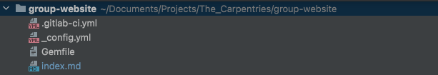
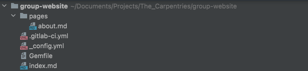

::::::::::::::::::::::::::::::::::::::: objectives

- Publish Markdown files as HTML on the web with GitHub Pages

::::::::::::::::::::::::::::::::::::::::::::::::::

:::::::::::::::::::::::::::::::::::::::: questions

- How do I publish web pages through GitLab and Jekyll?

::::::::::::::::::::::::::::::::::::::::::::::::::

[Jekyll](https://jekyllrb.com/) es un potente generador de sitios estáticos que puede
estar detrás de GitLab Pages. Crea contenido HTML estático para sitios web a partir de
varios archivos de tu repositorio (archivos Markdown, hojas de estilo CSS,
plantillas/diseños de página, etc.). Este contenido 'compilado' es luego servido como tu
sitio web.

Jekyll facilita la gestión de su sitio web porque depende de plantillas. Las plantillas
(o diseños en notación Jekyll) son planos que pueden ser reutilizados por múltiples
páginas. Por ejemplo, nosotros (tus instructores) no hemos dado estilo a cada uno de los
ejercicios de esta lección por separado: hemos creado una plantilla que especifica cómo
deben mostrarse los ejercicios (el cuadro naranja, el cuadro de solución desplegable,
etc.) y cada vez que etiquetamos un bloque de texto como "Ejercicio" se muestra de esta
manera.

Cubriremos los diseños de Jekyll en un momento; por ahora empecemos a aprender Jekyll y
su lenguaje de scripting llamado
[Liquid](https://shopify.github.io/liquid/basics/introduction/).

## Parámetros globales

También en este caso, activaremos y personalizaremos nuestro despliegue desde el archivo
`.gitlab-ci.yml`. Puedes decidir editar tu versión anterior del repositorio
`group-website`, pero te sugerimos crear uno nuevo. Siga los pasos en "Configuración de
un proyecto" en la
[introducción](https://grp-bio-it-workshops.embl-community.io/building-websites-with-gitlab/01-introduction/index.html)
si desea hacerlo. Crea/cambia el contenido del fichero `.gitlab-ci.yml` con:

```yaml 
image: ruby:latest

pages:
  script:
    - gem install bundler
    - bundle install
    - bundle exec jekyll build -d public
  artifacts:
    paths:
      - public
  only:
    - main
```

> 
Este código requiere que el script se ejecute en el entorno de la última versión de
Ruby, instala la gema Jekyll, y construye el sitio en la ruta pública (creando la
carpeta remotamente, no debes preocuparte por ello en este punto). El resultado afecta
sólo a la rama principal.

La ejecución de este pipeline también requiere un `Gemfile`. Créelo en la carpeta raíz
con el siguiente contenido:

```shell 
source "https://rubygems.org"

gem "jekyll"
```

> 
En resumen, pero lo veremos con más detalle, Jekyll busca archivos de texto que empiecen
con una cabecera formateada así:

```source
---
variable: value
other_variable: other_value
---

...stuff in the page...
```

> 
e inserta los valores de esas variables en la página al formatearla. Los tres guiones
que comienzan la cabecera *deben* ser los tres primeros caracteres del archivo: incluso
un solo espacio antes de ellos hará que Jekyll ignore el archivo.

El contenido de la cabecera debe estar formateado como YAML, y puede contener booleanos,
números, cadenas de caracteres, listas y diccionarios de pares nombre/valor. Los valores
de la cabecera se denominan en la página `page.variable`. Por ejemplo, esta página:

```source
---
name: Science
---
Today we are going to study {{page.name}}.
```

> 
se traduce como:

```html
<html>
  <body>
    <p>Today we are going to study Science.</p>
  </body>
</html>
```

> 
::::::::::::::::::::::::::::::::::::::  challenge

## Ejercicio: Sintaxis de Jekyll

Pon a prueba tu comprensión de la sintaxis de Jekyll. ¿A qué se traduciría esta
plantilla?

```source
---
name: Tom
location: Heidelberg
---
{{page.name}} is in {{page.location}}. I believe {{page.location}} is a very nice city.
```

> ## Solución
> 
> ```html
> <html>
>   <body>
>     <p>Tom is in Heidelberg. I believe Heidelberg us a very nice city.</p>
>   </body>
> </html>
> ```

::::::::::::::::::::::::::::::::::::::::::::::::::

Sin embargo, las principales opciones de configuración de Jekyll se especifican en otro
fichero, llamado `_config.yml`. Vamos a crear algunos parámetros de configuración para
nuestro sitio web.

1. Cree un archivo `_config.yml` en el directorio raíz de su sitio.
2. Añádele los parámetros `description` y `email` como:

```yaml
description: This project develops training materials for reseachers wanting to learn to build project
websites in GitLab Pages.
email: team@carpentries.org
```

> 
Los parámetros de configuración global de `_config.yml` están disponibles como variable
`site.PARAMETER_NAME` en cada página dentro del sitio web. Por lo tanto, el parámetro
global `email` que definimos anteriormente sería accesible como `site.email`. Nota:
estos son parámetros globales, por lo tanto diferentes de los parámetros locales
específicos de la página en los ejemplos anteriores.

Para acceder al valor del parámetro dentro de una página, se utiliza la notación de
Liquid para mostrar el contenido rodeando una variable entre llaves como `{{ variable }}`.

:::::::::::::::::::::::::::::::::::::::::  callout

## Parámetros globales predefinidos

Además de los parámetros globales que defina, Jekyll también pone a su disposición una
serie de [útiles variables predefinidas para todo el sitio](https://jekyllrb.com/docs/variables#site-variables) dentro de su sitio web: por
ejemplo `{{ site.time }}` (la hora actual) o `{{ site.pages }}` (una lista de todas las páginas).

::::::::::::::::::::::::::::::::::::::::::::::::::

Cree un archivo `index.md` en la carpeta raíz, con el siguiente contenido:

```markdown 
---
title: My first Jekyll page
---

# Building Websites with Jekyll and GitLab

## Description
{{ site.description }}
Welcome to {{ page.title }}

Have any questions about what we do? [We'd love to hear from you!](mailto:{{ site.email }})
```

> 
Tu proyecto debe incluir los siguientes archivos:

{alt='Basic Jekyll' .image-with-shadow width="600px" }

Confirme y envíe sus cambios, después monitorice la ejecución del proceso y compruebe el
resultado final en su URL `https://<your user name>.embl-community.io/group-website`.

:::::::::::::::::::::::::::::::::::::::  challenge

## Ejercicio: Crear un parámetro global de Twitter

En `about.md` tenemos una URL de Twitter bajo la sección `Contacta con nosotros`. Esa
es una pieza de información que podría ir en los parámetros globales en `_config.yml`
ya que es posible que desee repetirlo en un pie de página de cada página. Realice
cambios en su sitio web para extraer la URL de Twitter como parámetro global.

> ## Solución
> 
> 1. Añade el parámetro twitter a `_config.yml`:
>   
>   ```yaml
>   description: "This research project develops training materials for reseachers wanting to learn to build project
>   websites in GitHub with GitHub Pages."
>   email: "team@carpentries.org"
>   twitter: "https://twitter.com/thecarpentries"
>   ```
> 
> 2. Hacer uso del parámetro twitter en `about.md`:
>   
>   ```markdown 
>   # About
>   
>   ## Project
>   
>   {{ site.description }}
>   
>   ## Funders
>   
>   We gratefully acknowledge funding from the XYZ Founding Council, under grant number 'abc'.
>   
>   ## Cite us
>   
>   You can cite the project as:
>   
>   > *The Carpentries 2019 Annual Report. Zenodo. https://doi.org/10.5281/zenodo.3840372*
>   
>   ## Contact us
>   
>   - Email: [{{ site.email }}](mailto:{{ site.email }})
>   - Twitter: [{{ site.twitter }}]({{ site.twitter }})
>   ```
> 
> 3. Ten en cuenta que en realidad no deberías ver ningún cambio en tu sitio web. Sin
>   embargo, ahora puede acceder a su URL de Twitter desde cualquier página del sitio
>   web, en caso de que lo necesite.

::::::::::::::::::::::::::::::::::::::::::::::::::

## Parámetros locales

Además de los parámetros globales (para todo el sitio) disponibles a través de la
variable global `site`, Jekyll pone a su disposición información *local* (específica de
la página) a través de la variable `page`. Algunos de estos parámetros están
predefinidos - como `page.title`, que te da el título de la página que está actualmente
activa/visitándose. Otras puede definirlas usted mismo. Consulte esta [lista de parámetros de página predefinidos](https://jekyllrb.com/docs/variables#page-variables).

Puede definir parámetros locales utilizando notación YAML dentro de una página Markdown
incluyéndola en una cabecera de página y delimitando la cabecera con líneas discontinuas
triples `---`. Estas cabeceras se llaman *front matter* y se usan para establecer
variables y metadatos en páginas individuales de tu sitio Jekyll.

:::::::::::::::::::::::::::::::::::::::::  callout

## Portada

Del [sitio web de Jekyll](https://jekyllrb.com/docs/front-matter/):

> Cualquier archivo que contenga un bloque YAML front matter será procesado por Jekyll
> como un archivo especial. El front matter debe ser lo primero en el archivo y debe
> tener la forma de un conjunto YAML válido entre líneas discontinuas triples.

::::::::::::::::::::::::::::::::::::::::::::::::::

:::::::::::::::::::::::::::::::::::::::::  callout

## Los parámetros globales y locales distinguen entre mayúsculas y minúsculas

Es importante tener en cuenta que los parámetros utilizados en los sitios distinguen
entre mayúsculas y minúsculas. Por convención, suelen ir todos en minúsculas.

::::::::::::::::::::::::::::::::::::::::::::::::::

He aquí un ejemplo:

```yaml 
---
layout: post
title: "My first blog post"
author: "Danger Mouse"
---
```

> 
Entre estas tres líneas discontinuas, puedes sobrescribir variables predefinidas (como
`page.layout` o `page.title`) o crear las que necesites localmente en la página (como
`page.author`). Podrá acceder a estas variables utilizando las etiquetas de Liquid (por
ejemplo, `{{ page.title }}` ) más abajo en el
archivo y también en cualquier archivo que incluya éste. Tenga en cuenta que estas
variables sólo son accesibles en esa página. Obtendrá un error si intenta hacer
referencia a una `page.variable` definida en una página diferente.

:::::::::::::::::::::::::::::::::::::::  challenge

## Ejercicio: Practica con Variables Locales

Practiquemos la creación y el uso de variables locales. Piensa en una variable local
que quieras utilizar sólo en tu página `about.md` o `index.md`. Si no se te ocurre
ninguna, crea una variable local llamada `lección-ejemplo` con el valor
`https://carpentries.github.io/lesson-example/` y haz referencia a ella en tu
`index.md`.

¿Qué has añadido a tu `index.md` para crear esta variable? ¿Dónde añadiste la materia
prima en tu `index.md`? ¿Cómo hiciste referencia a esa variable?

> ## Solución
> 
> Cree una cabecera YAML en la parte superior de `index.md` y añada la variable
> `lesson-example` entre los delimitadores de triple guión. A continuación, puede
> hacer referencia al valor dentro de su página `index.md` como `{{ page.lesson-example }}`. Su archivo debería tener ahora el
> siguiente aspecto:
> 
> ```markdown 
> ---
> lesson-example: "https://carpentries.github.io/lesson-example/"
> ---
> 
> # Building Websites in GitHub
> 
> ## Description
> {{ site.description }}
> 
> More details about the project are available from the [About page](about).
> 
> See some [examples of our work]({{ page.lesson-example }}).
> 
> Have any questions about what we do? [We'd love to hear from you!](mailto:{{ site.email }})
> ```
> 
> Tenga en cuenta que esta variable no es accesible desde la página `about.md` y es
> local a `index.md`.

::::::::::::::::::::::::::::::::::::::::::::::::::

## Añadir nuevas páginas

El siguiente paso será crear otra página de este sitio web. Idealmente, nuestro sitio
web tendrá múltiples páginas y por lo tanto, para mantener las cosas en orden, crearemos
la carpeta `pages` para almacenarlas. En esta carpeta, cree un archivo `about.md` con el
siguiente contenido:

```markdown 
---
title: About
permalink: /about/
---

# About

## Project

{{ site.description }}

## Funders

We gratefully acknowledge funding from the XYZ Founding Council, under grant number 'abc'.

## Cite us

You can cite the project as:

>    *The Carpentries 2019 Annual Report. Zenodo. https://doi.org/10.5281/zenodo.3840372*

## Contact us

- Email: [{{ site.email }}](mailto:{{ site.email }})
- Twitter: [@thecarpentries](https://twitter.com/thecarpentries)
```

> 
Observe que la dirección URL de esta página se especifica en la cabecera, mediante el
atributo `permalink`.

Este es el aspecto actual de sus carpetas:

{alt='Acerca de Jekyll' .image-with-shadow width="600px" }

Ahora, debemos editar el archivo `index.md` para incluir un enlace a esta nueva página
acerca de, con el fin de ser capaz de llegar a ella desde la página principal. Añade una
línea en `index.md` para incluir:

```markdown 
More details about the project are available from the [About page](about).
```

> 
El enlace en esta línea redirigirá a `https://<your user name>.embl-community.io/group-website/about`, que es la URL de nuestra nueva página
acerca de.

Commit, push y vaya a su sitio web para ver los cambios. Ten en cuenta que los
parámetros del sitio no se mostrarán correctamente cuando veas los archivos en GitHub
(se mostrarán como texto `{{ site.PARAMETER_NAME }}` en lugar del
valor mostrado del parámetro) pero sí en el sitio web.

:::::::::::::::::::::::::::::::::::::::::  callout

## Reutilizar y reducir

Los parámetros globales de Jekyll son una forma útil de mantener toda la configuración
de tu sitio en un único lugar (incluso si sólo los usas una vez). En combinación con
los layouts/plantillas de Jekyll (que veremos en el próximo episodio) son una buena
forma de crear fragmentos de código reutilizables que pueden repetirse en varias o
incluso en todas las páginas de tu sitio web. La reutilización te ayuda a reducir la
cantidad de código que tienes que escribir.

::::::::::::::::::::::::::::::::::::::::::::::::::

## Enlaces útiles

Esto sólo pretendía ser un tutorial muy básico. Las posibilidades de personalización de
sitios con Jekyll van mucho más allá de lo mostrado aquí, podrías por ejemplo:

- diseño de páginas (como los ejercicios/soluciones de esta lección),
- trabajar con bucles para procesar variables que contienen múltiples valores de forma
  iterativa,
- utilizar filtros para controlar el formato de las variables cuando se insertan en una
  página,

y más. [Esta lección](https://carpentries-incubator.github.io/jekyll-pages-novice/) de
The Carpentries, aunque diseñada para GitHub, es un recurso valioso para aprender más
sobre cómo hacerlo.

Si buscas la documentación oficial de GitLab sobre GitLab Pages con Jekyll, sigue [este enlace](https://docs.gitlab.com/ee/user/project/pages/getting_started/pages_from_scratch.html).

Por último, [este proyecto](https://gitlab.com/pages/jekyll) contiene una plantilla más
elaborada de un sitio web basado en GitLab y Jekyll.


:::::::::::::::::::::::::::::::::::::::: keypoints

- Through Jekyll, GitLab serves pages are generated from `.md` files

::::::::::::::::::::::::::::::::::::::::::::::::::


