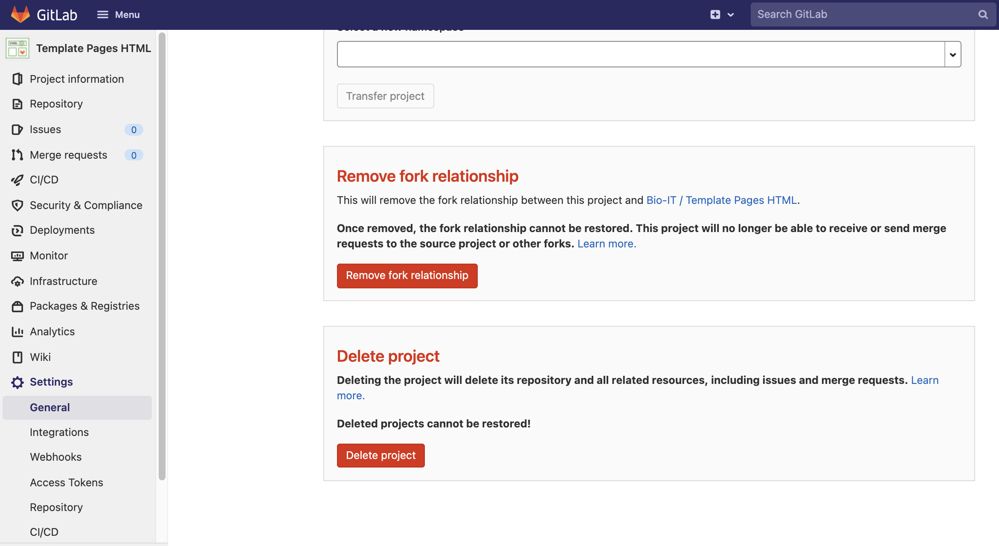

## Plantillas Bio-IT

Las plantillas que hemos desarrollado juntos están disponibles en nuestra plataforma
GitLab:
- [Plain HTML template](https://git.embl.de/grp-bio-it/template_pages_html)
- [Plantilla Jekyll](https://git.embl.de/grp-bio-it/template-pages-jekyll)
- [Plantilla Sphinx](https://git.embl.de/grp-bio-it/template-pages-sphinx)
- [Jupyter book](https://git.embl.de/grp-bio-it/template-jupyter-book)

Pueden ser ligeramente enriquecidos en comparación con lo que hemos visto durante esta
lección, por ejemplo la plantilla HTML simple también cuenta con un archivo `.css`, pero
se mantienen al mínimo a propósito. Si quieres usarlos como base para tu propio
proyecto, deberías **forkearlos**. Si lo haces para desarrollar tu propio proyecto, y no
para contribuir a la plantilla en sí, debes **eliminar la relación de bifurcación**.
Repasemos juntos el proceso.

Fork un proyecto haciendo clic en el botón "Fork" a la derecha del título del proyecto.
Esto abrirá un menú (mostrado abajo) muy similar al que aparece cuando abres un nuevo
proyecto. Puedes decidir mantener tu proyecto en privado y editar el título y la
descripción. También puede colocarlo en el grupo/espacio de nombres correspondiente.

Una vez que haya terminado, por favor, elimine la relación de bifurcación. Puede editar
la configuración del proyecto en el menú de la izquierda en la página del proyecto,
siga: `Settings > General > Advanced` y luego desplácese hacia abajo hasta la tarjeta
"Eliminar relación de bifurcación".

Una vez hecho esto, puedes clonar tu repositorio localmente y empezar a editar la
plantilla. Si necesitas una recapitulación sobre clonación, fork, push y pull en Git por
favor revisa [esta lección](https://swcarpentry.github.io/git-novice/) por The
Carpentries.

## Más plantillas

¿Te preguntas dónde puedes encontrar más ejemplos de proyectos de páginas de GitLab?
Consulta [este enlace](https://gitlab.com/pages). Incluye más de 40 ejemplos, basados en
múltiples tecnologías. También en estos casos, es una buena práctica eliminar la
relación fork si tu objetivo es utilizar la plantilla para el desarrollo de tu propio
sitio web, y no contribuir a la plantilla en sí. Algunos ejemplos de plantillas que
encontrarás en este repositorio son:
- [**courseware-template**](https://gitlab.com/pages/courseware-template), una plantilla
  basada en Jekyll para el sitio web de un curso. Puede verla en acción
  [aquí](https://courseware-as-code.gitlab.io/courseware-tutorial/). Incluye estilos
  para dar formato al contenido de las clases, cuestionarios y diapositivas.
- [**hugo blog template**](https://gitlab.com/pages/hugo), la plantilla para [construir blogs](https://pages.gitlab.io/hugo/) basada en [Hugo](https://gohugo.io/).
- [**jupyterbook**](https://gitlab.com/pages/jupyterbook), una plantilla para generar
  libros y documentos integrando código Python. Véalo renderizado
  [aquí](https://pages.gitlab.io/jupyterbook/intro.html).

Ahora tienes todos los conocimientos necesarios para empezar a jugar con las páginas de
GitLab. No dudes en [contactar con nosotros](mailto:bio-it@embl.de) si tienes alguna
pregunta o abrir una incidencia en los proyectos de plantilla para solicitar
características o plantear problemas. También eres bienvenido a contribuir al desarrollo
de plantillas de páginas, tanto las existentes como las nuevas que puedan encajar en tus
casos de uso. Por último, consulta el siguiente capítulo (extra) para saber cómo tratar
los errores en la ejecución de la canalización y poder solucionar posibles errores de
CI/CD



