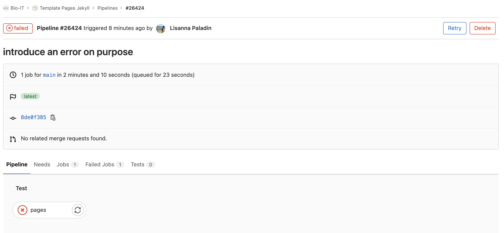

::::::::::::::::::::::::::::::::::::::: objectives

- Obtén feedback de GitLab sobre por qué ha fallado una pipeline

::::::::::::::::::::::::::::::::::::::::::::::::::

:::::::::::::::::::::::::::::::::::::::: questions

- ¿Cómo soluciono errores en las pipelines de GitLab? 

::::::::::::::::::::::::::::::::::::::::::::::::::

## Cuando las cosas van mal

Hasta ahora hemos visto cómo utilizar con éxito varias tecnologías para producir un
sitio web. Sin embargo, hay algunas situaciones en las que pueden fallar debido a un
error tipográfico o a la falta de información. Vamos a ver uno de estos casos con un
ejemplo de Jekyll.

::::::::::::::::::::::::::::::::::::::  challenge

## Ejercicio: Solución de problemas de Jekyll

Este ejercicio le ayudará a reconocer cómo son los errores más comunes cuando se
trabaja con estos elementos de un sitio web Jekyll.

Edite su archivo `_config.yml` y sustituya un carácter `:` por un carácter `=` en una
de las variables.

> ## Solución
> 
> Por ejemplo, `mail=team@carpentries.org` en lugar de `mail:team@carpentries.org`.
> 
> ```yaml
> description: "This research project develops training materials for reseachers wanting to learn to build project
> websites in GitHub with GitHub Pages."
> email: "team@carpentries.org"
> twitter: "https://twitter.com/thecarpentries
> ```
> 
> Si navegas por tu repositorio de GitHub podrás ver que algo se rompe en `about.md`
> donde usamos `{{ site.twitter }}` sin embargo, al contrario de
> lo que vimos antes con Markdown inválido, Jekyll se negará a construir la página y
> producirá un mensaje de error.
> 
> Después veremos dónde encontrar el mensaje de error e identificar qué los causó.

::::::::::::::::::::::::::::::::::::::::::::::::::

Si estabas echando un ojo a la página de ejecución del pipeline de GitLab hasta ahora
(`CI/CD > Pipelines`), te habrás dado cuenta de que una vez que empujas el pipeline
resulta "pendiente", luego empieza a "ejecutarse", y finalmente "pasa". Eventualmente.
Si no lo hace, entonces el estado es "fallido", es posible que recibas un correo
electrónico al respecto (dependiendo de la configuración de tu cuenta de GitLab) y no
debes entrar en pánico. ¿Cómo podemos entender qué causó el error y solucionarlo? El
estado "fallido" resulta ser un botón, hagamos clic en él.

{alt='haga clic en el botón de error para acceder al registro de la tubería'}

Una vez más, puede hacer clic en el botón ❌ <span style="color:red">pages</span> para
acceder a más detalles, es decir, al registro completo de la ejecución de nuestro
pipeline. Desplázate por la ventana tipo terminal para ver cómo se inició, preparó los
entornos, instaló dependencias y ejecutó correctamente hasta el comando `bundle exec jekyll build - public`. ¿Lo recuerdas? Es el comando que lanza Jekyll, lo incluimos en
el fichero `.gitlab-ci.yml`.

Basándonos en esto, tenemos razones para sospechar que el error aquí está relacionado
con que Jekyll no puede construir la página. Leyendo más detenidamente para obtener más
detalles, encontramos:

```bash 
$ bundle exec jekyll build -d public
                    ------------------------------------------------
      Jekyll 4.2.1   Please append `--trace` to the `build` command
                     for any additional information or backtrace.
                    ------------------------------------------------
/usr/local/bundle/gems/safe_yaml-1.0.5/lib/safe_yaml/load.rb:143:in `parse': (/builds/hpg_ToyM/0/grp-bio-it/template-pages-jekyll/_config.yml): could not find expected ':' while scanning a simple key at line 3 column 1 (Psych::SyntaxError)
```

> 
Esto significa dos cosas: en primer lugar, el registro sugiere una forma de obtener
eventualmente más detalles, es decir, modificar el fichero `.gitlab-ci.yml` añadiendo
`--trace` al comando `bundle exec jekyll build -d public`, que se convierte así en
`bundle exec jekyll build -d public --trace`. Sin embargo, en realidad no necesitamos
eso: la siguiente frase es suficientemente clara. Dice, hubo un error al analizar el
fichero `_config.yml` porque Jekyll no pudo encontrar el carácter `:` esperado. Como
este error impide a Jekyll construir la página, el proceso no puede continuar.

::::::::::::::::::::::::::::::::::::::::  callout

## El fallo no eliminará su página web

Dado el fallo, puede que se pregunte qué ha pasado con la página web Si visita la
dirección encontrará que el sitio web sigue estando disponible.

GitLab mantendrá tu versión anterior en línea hasta que el error sea corregido y una
nueva compilación sea completada con éxito.

::::::::::::::::::::::::::::::::::::::::::::::::::

Deberíamos volver a nuestro archivo `_config.yml` y corregir el error `=` que cometimos
(a propósito, esta vez). A continuación, empuje el proyecto de nuevo, ¡y problema
resuelto!

:::::::::::::::::::::::::::::::::::::::  challenge

## Ejercicio: Practicar con la solución de problemas de Jekyll

A veces ocurren errores tipográficos que pueden hacer que su sitio web cambie de forma
sorprendente. Experimentemos con algunos posibles problemas que puedan surgir y veamos
qué ocurre.

Pruebe los cambios que se indican a continuación en su archivo `index.md` y compruebe
qué sucede cuando se renderiza la página. Querrá corregir el error anterior cada vez.

1. Utilice una variable global o local que no haya definido primero.
2. Quite el guión del final de la cabecera YAML.
3. No ponga un espacio entre la cabecera YAML y el resto de la página
4. Coloque la cabecera YAML en un lugar diferente de la página.

> ## Solución
> 
> 1. El lugar donde usó la variable indefinida está en blanco pero por lo demás no hay
>   error. Ejemplo:
>   
>   ```markdown 
>   Hi! {{ site.greeting }}. What have you been up to?
>   ```
> 
> 2. La cabecera muestra algo en el archivo y la variable que se definió va a la
>   página de índice en lugar del enlace que establecimos.
>   
>   ```markdown 
>   ---
>   lesson-example: "https://carpentries.github.io/lesson-example/"
>   
>   Examples of our work can be found at: {{ page.lesson-example }}
>   ```
> 
> 3. Esto no parece afectar a nuestra página pero a menudo puede hacer que páginas más
>   complejas se rompan.
>   
>   ```markdown 
>   ---
>   lesson-example: "https://carpentries.github.io/lesson-example/"
>   ---
>   Examples of our work can be found at: {{ page.lesson-example }}
>   ```
> 
> 4. Esto también hace que la cabecera se muestre un poco en la página y rompe el
>   enlace variable que creamos.
>   
>   ```markdown 
>   Examples of our work can be found at: {{ page.lesson-example }}
>   ---
>   lesson-example: "https://carpentries.github.io/lesson-example/"
>   ---
>   ```

Nota: Asegúrese de corregir cualquier error que haya introducido intencionadamente en
su página antes de continuar.

::::::::::::::::::::::::::::::::::::::::::::::::::

:::::::::::::::::::::::::::::::::::::::: keypoints

- Si falla una pipeline, GitLab proveerá información útil sobre por qué

::::::::::::::::::::::::::::::::::::::::::::::::::


